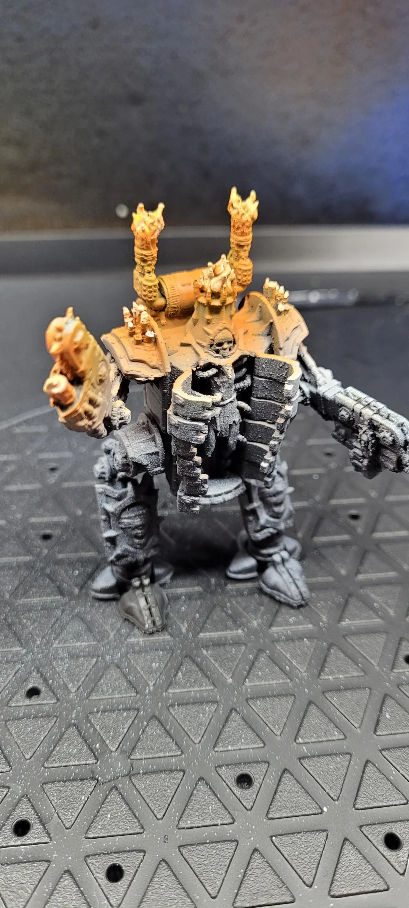
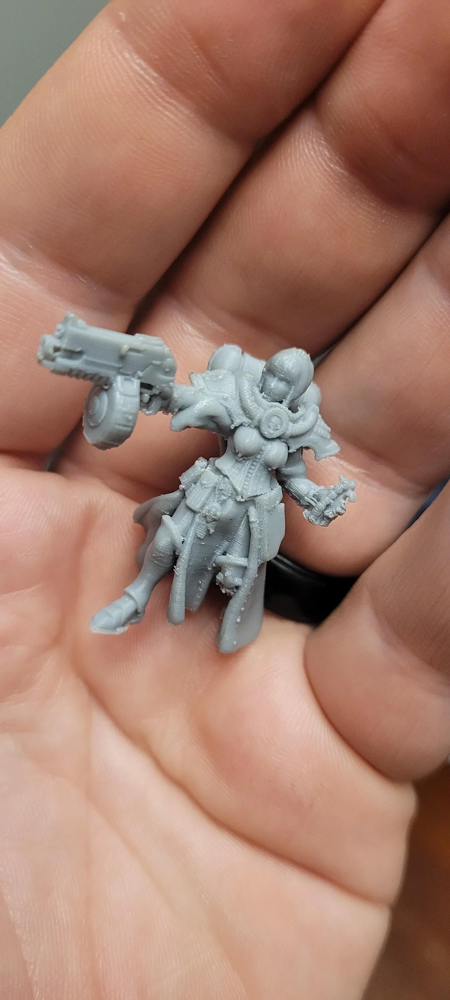

json files for presets on ORCA slicer for FDM minis on *ender 3 v3 se* included are the following:
- machine settings
- filament settings i use sunlu [PLA+](https://www.sunlu.com/collections/pla-plus-fliament) 
- print process settings

mods on my personal machine:
- noctua mod [reddit thread](https://www.reddit.com/r/Ender3V3SE/comments/1949xsc/creality_ender3_v3_se_fan_upgrade_replace_20mm/)
- nebula kit [creality site](https://store.creality.com/ca/products/creality-nebula-smart-kit?cfb=70fef914-abe3-4be9-80a4-ab93be5827f1&ifb=70fef914-abe3-4be9-80a4-ab93be5827f1&scm=search.v39.101.768.103.104&score=1&ssp=&spm=..search.search_1.1)
- pei plate (worth mentioning i usuially use glue also because the first layer is hard and Uber important)
- 0.02mm nozzles [ali express](https://www.aliexpress.com/item/1005006371262623.html?spm=a2g0o.productlist.main.3.6d6d4027fxn8Hv&algo_pvid=23bc3380-8871-4810-91a3-91f29ee4ee83&algo_exp_id=23bc3380-8871-4810-91a3-91f29ee4ee83-1&pdp_npi=4%40dis%21CAD%213.70%213.70%21%21%2118.49%2118.49%21%402101c5a417341491841717352ea1b9%2112000037099930963%21sea%21CA%210%21ABX&curPageLogUid=w4mj0fZ1PsLY&utparam-url=scene%3Asearch%7Cquery_from%3A)
- also worth mentioning post processing i remove the supports carefully then scrape what i can with an xacto or hobby knife, then and this could be the most important part i use a BUTANE torch to burn away any leftover bits and strings QUICKLY and because its butane it gets REAL hot REAL quick but not for a sustained amount of time so it smooths the exterior a bit without warping any of the actual print itself.

the .orca_printer file is the whole set to be uploaded to orca

below are some examples of my results. this may get updated over time

